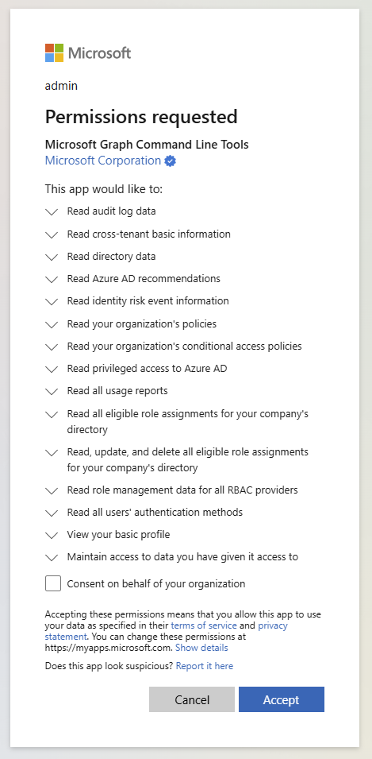
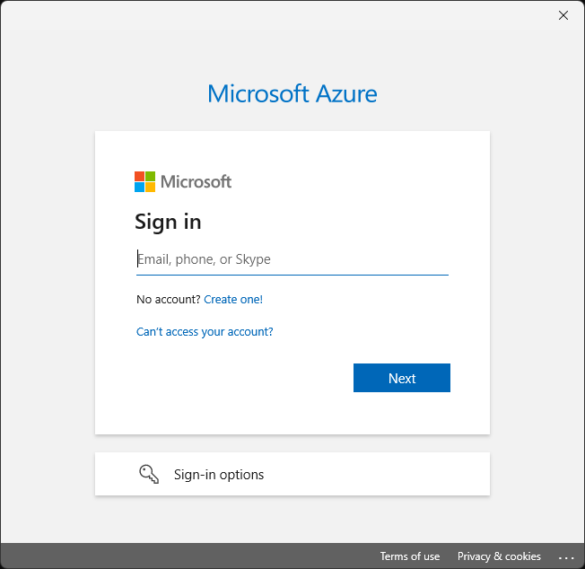
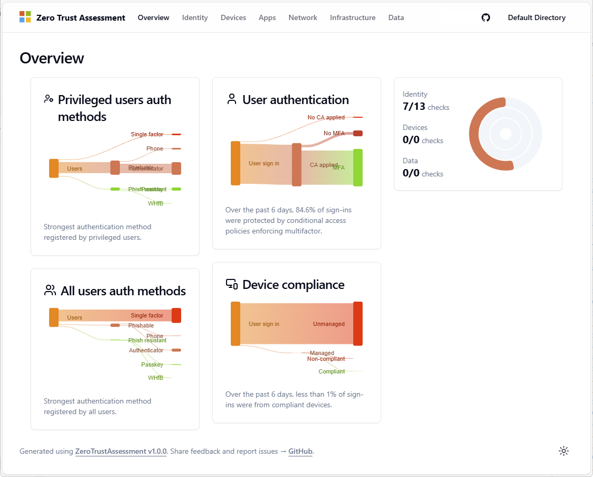
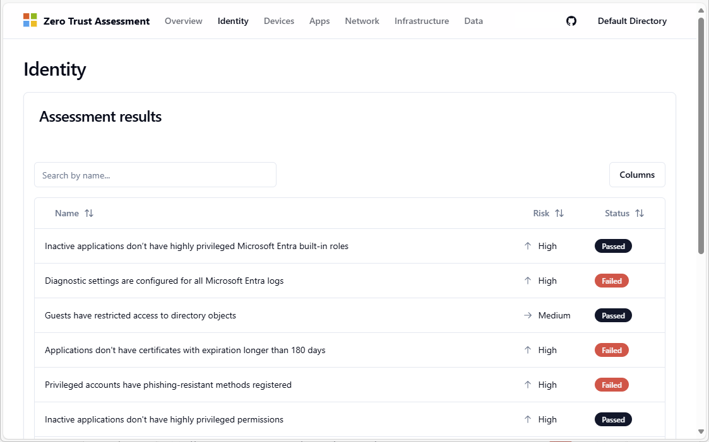
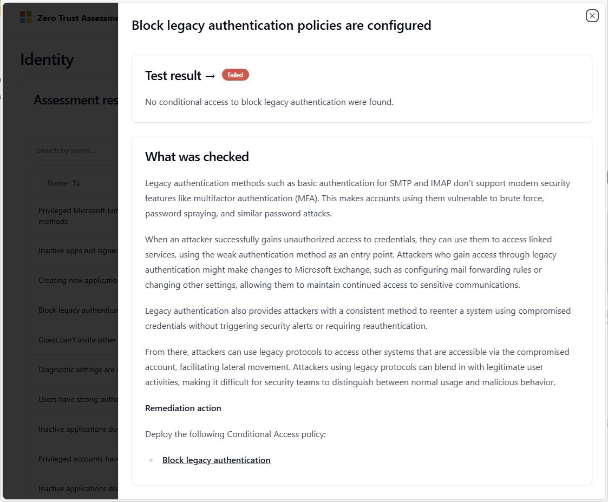

# Microsoft Zero Trust Assessment V2 - Private Preview

> The shortlink to this page is: [aka.ms/zerotrust/v2/privatepreview](https://aka.ms/zerotrust/v2/privatepreview)

## About the Zero Trust Assessment tool

As the security threat landscape evolves, Microsoft continues to respond and re-evaluate default tenant security settings.​ Based on insights, experience and learnings Microsoft will continue to change the default tenant security settings in the product over time.

Microsoft publishes the [Entra Security Recommendations](https://aka.ms/entrasecurityrecommendations) guidance to help customers to act more quickly using Microsoft's latest guidance, re-evaluate existing tenant security settings and make change in advance of our product updates.

Manually checking a tenant's configuration against the published guidance can be time consuming and error project. The Zero Trust Assessment PowerShell module was built to help with this activity.

The Zero Trust Assessment module in this private preview helps customers perform an automated security assessment. This works by assessing the tenant configuration and provides guidance on how to improve the security of the tenant.

_This initial release is limited to Microsoft Entra._

## Prerequisites

- PowerShell v7

> The assessment uses PowerShell modules that are only compatible with
> PowerShell 7. Install PowerShell v7 if not already installed:
> [Installing PowerShell on Windows - PowerShell \| Microsoft
> Learn](https://learn.microsoft.com/en-us/powershell/scripting/install/installing-powershell-on-windows?view=powershell-7.4#installing-the-msi-package)

- Global Administrator role
  - Note: The module supports running the assessment as a Global Reader, but the Global Administrator role is required to initially connect to Microsoft Graph and consent to permissions.

## Install the PowerShell modules

Follow these steps to install the assessment and connect to Microsoft Graph and your tenant.

### Open PowerShell 7

Open PowerShell 7 by searching in your Start Menu for `PowerShell 7`, or open PowerShell 7 directly via the path: `C:\Program Files\PowerShell\7\pwsh.exe`

*When prompted to install modules from an untrusted repository, choose `Yes to All`.*

### Install Zero Trust Assessment V2 module

Install the `ZeroTrustAssessmentV2` module using the following command.

```powershell
Install-Module ZeroTrustAssessmentV2 -Scope CurrentUser
```

### Install Az.Accounts module

Install the Az.Accounts module by running the following command.

```powershell
Install-Module Az.Accounts -Scope CurrentUser
```

### Updating the modules

If you have previously installed the modules, run the following instead to ensure you have the latest versions of the modules.

```powershell
Update-Module ZeroTrustAssessmentV2 -Force -Scope CurrentUser 
Update-Module Az.Accounts -Force -Scope CurrentUser 
```

## Connect to Microsoft Graph and Azure

To run this assessment, you must connect to Microsoft Graph and
optionally to Azure. When connecting using Microsoft Graph PowerShell, the following permissions are requested. You are presented with a permissions requested page that you must consent to be able to run the assessment. 

The consent prompt is only be displayed if the Graph PowerShell app does not already have these permissions.

- AuditLog.Read.All
- CrossTenantInformation.ReadBasic.All
- Directory.Read.All
- DirectoryRecommendations.Read.All
- IdentityRiskEvent.Read.All
- IdentityRiskyUser.Read.All
- Policy.Read.All
- Policy.Read.ConditionalAccess
- Policy.Read.PermissionGrant
- PrivilegedAccess.Read.AzureAD
- Reports.Read.All
- RoleEligibilitySchedule.Read.Directory
- RoleEligibilitySchedule.ReadWrite.Directory
- RoleManagement.Read.All
- UserAuthenticationMethod.Read.All

Run the following command to connect to Microsoft Graph and consent to the permissions using a Global Administrator account.

```powershell
Connect-ZtAssessment
```

### Sign into Microsoft Graph

When prompted, sign into Microsoft Graph as a Global Administrator.

The assessment first connects to Microsoft Graph and then to Azure. A second window will open to perform the Azure sign in.


When prompted, review and accept the requested permissions.

The next time you connect, you won't be required to reconsent to the permissions.



### Sign into Azure

When prompted, sign into Azure as a Global Administrator.

The Azure sign in is required to check for export of Audit and sign in logs. If you don't have Azure, you can close the window without signing in and ignore the warning. The test that relies on Azure will be skipped.



If you have multiple subscriptions, select a tenant and subscription when prompted.


## Run the assessment

This assessment is a read-only assessment, and all data is run and
stored locally on the desktop. We recommend storing this report securely and deleting the generated folder and its contents from the local drive once the assessment is complete.

After providing Administrator consent to the permissions, you can run the assessment with an account that has been assigned the **Global Reader** role.

Use the following command to run the assessment.

```powershell
Invoke-ZtAssessment
```

The results are created in the current working folder `.\ZeroTrustReport\ZeroTrustAssessmentReport.html`. After the
assessment completes, the report is automatically opened in the default browser.

You can use the `-Path` parameter to provide a custom location to
store the assessment report. For example, the following command produces the report in the folder
`C:/MyAssessment01/ZeroTrustAssessmentReport.html`

```powershell
Invoke-ZtAssessment --Path C:/MyAssessment01
```

> The assessment may take more than 24 hours to run on large
tenants. Please do not abort the assessment while it is running (even if warnings and errors are logged)

## Review assessment results

After the assessment completes, you are redirected to the **Overview** tab of the report in your default browser. The **Overview** tab displays key Zero Trust related information about the tenant.



The **Identity** tab displays the list of checks that were run against the tenant and provide recommendations on addressing the tenant configuration information.



Select a result to see more information and remediation actions.



## Reporting issues

If you run into any issues or have queries about the results, reach out to your account contact that suggested you run the assessment.

### Export troubleshooting logs

If an issue occurs, export a log using these instructions.

Run the following command in the same session where you ran the
assessment to create the export package (update the date to reflect the date of your run).

```powershell
New-PSFSupportPackage -Path C:\AssessmentLog_2025_01_01 -Force
```

Zip this folder along with the folder that was created by
Invoke-ZtAssessment (default is `ZeroTrustAssessment`) and share it with your contact at Microsoft.

## Removing the Zero Trust assessment

To remove the assessment, follow these steps.

- Remove PowerShell module.
- Remove App Reg + consent.
- Delete the folder that was created by the assessment.

## Feedback / Issues

The **Identity** tab shows the results of the assessment on your tenant.

The other tabs are in progress. Feel free to share feedback on the
report. If you have any feedback or issues, reach out to your account contact that suggested you run the assessment or post in the private preview Teams channel.

## FAQs

### Why is the `RoleEligibilitySchedule.ReadWrite.Directory` permission requested for a read-only report?

- The [List roleAssignmentScheduleRequests](https://learn.microsoft.com/graph/api/rbacapplication-list-roleassignmentschedulerequests?view=graph-rest-1.0&tabs=http) Graph API call requires this permission RoleEligibilitySchedule.ReadWrite.Directory.

- You can run this report as a Global Reader to ensure that no changes are made.

### How can I know what the script is doing?

- The code for this assessment is open source and can be reviewed at `https://github.com/microsoft/zerotrustassessment/tree/psnext/src/powershell`

### Error: The type initializer for 'DuckDB.NET.Data.DuckDBConnectionStringBuilder' threw an exception

On a new installation of Windows you may run into the following error.

```text
The type initializer for 'DuckDB.NET.Data.DuckDBConnectionStringBuilder' threw an exception.
Inner exception: Unable to load DLL 'duckdb' or one of its dependencies: The specified module could not be found. (0x8007007E)
Inner exception type: DllNotFoundException
```

This error occurs because you are running on a system that does not include Microsoft Visual C++ 2015-2022 Redistributable (x64) - Microsoft.VCRedist.2015+.x64

You can download and install VCRedist from [download.visualstudio.microsoft.com](https://download.visualstudio.microsoft.com/download/pr/2c6b06c4-dc6a-4496-b769-b0d311cf515d/463F736D5925566EDC0E8F7D8E70C0A1FC95ADF44AFA5D5390B979F5A35934CC/VC_redist.x64.exe)
